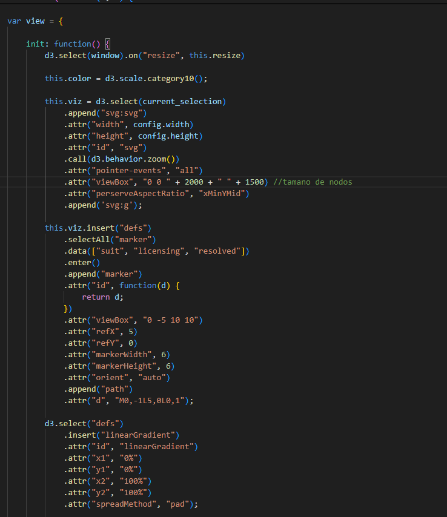

# Proyecto 3 
# Visualización de información

_Integrantes:_
- David Blanco: 2020053806
- Luis Felipe Calderón Pérez: 2021048663

El objetivo de este proyecto es crear tres diferentes visualizaciones de redes utilizando un modelo cliente-servidor, en donde el servidor generará el modelo geométrico de la red y el cliente permitirá visualizar e interactuar con dicho modelo.

## Introduccion

El Proyecto tiene como objetivo crear tres visualizaciones diferentes de (forced direct graph) utilizando un modelo cliente-servidor. En este modelo, el servidor generará el modelo geométrico de la red, mientras que el cliente permitirá visualizar e interactuar con dicho modelo. Para lograr esto, se trabajará con tres conjuntos de datos específicos: la red de trastornos y genes patológicos (Diseases), el estudio topológico de la web EuroSiS (Eurosis), y las redes de contacto en un centro de enseñanza primaria (School). Cada uno de estos conjuntos de datos se procesará para generar visualizaciones dinámicas mediante D3.js, utilizando la técnica de grafo de fuerzas. Estas visualizaciones permitirán a los usuarios explorar y analizar las redes de manera interactiva, ofreciendo funcionalidades como la consulta de etiquetas de nodos, zoom y pan.

## Descripción del problema

Se deberá generar visualizaciones para cada uno de los conjuntos de datos que se detallan a continuación:

1. diseases: consiste de la red de trastornos y genes patológicos vinculados por asociaciones conocidas entre genes y trastornos, lo que indica el origen genético común de muchas enfermedades. El conjunto de datos original puede consultarse como: The Human Disease Network, Goh K-I, Cusick ME, Valle D, Childs B, Vidal M, Barabási A-L (2007), Proc Natl Acad Sci USA 104:8685-8690.

2. eurosis: Estudio topológico de la web EuroSiS: Mapeo de las interacciones entre los actores de Science in Society en la Web de 12 países europeos.

3. school: Este conjunto de datos forma parte de án estudio de las redes de contacto en un centro de enseñanza primaria, del que se informa en el artículo High-Resolution Measurements of Face-to-Face Contact Patterns in a Primary School.

**Generación del modelo geométrico**

Se deben crear tres funciones en Netlify que lean los anteriores archivos de datos y generen los respectivos modelos geométricos, utilizando D3.js, mediante la técnica de grafo de fuerzas (force-directed layout). Note que no se debe generar el SVG directamente en el servidor sino que eso será realizado por el cliente.

**Visualización en el cliente (browser)**

Se debe crear una página web, utilizando D3.js,, que permita visualizar cada uno de los archivos del modelo geométrico generados en Netlify. Esta visualización debe permitir consultar la etiqueta de cada nodo seleccionado, así como realizar acercamientos (zoom), alejamientos (unzoom), y corrimientos (pan).

## Fuentes de datos

Las fuentes de datos son orígenes desde los cuales se pueden obtener datos. Estos pueden ser de diversos tipos y pueden provenir de diferentes lugares y formatos. Las fuentes de datos son esenciales en el campo de la informática, la investigación y la toma de decisiones empresariales, ya que proporcionan la información necesaria para análisis, informes y desarrollo de estrategias. A continuación, se presentan algunas definiciones y ejemplos de diferentes tipos de fuentes de datos:

#### Fuentes de datos primarios

Estos se pueden definir como: “se obtienen originalmente y se documentan por primera vez”(Stewart, 2024). El proceso para recopilar datos primarios utiliza estrategias que facilitan la obtención de los mismos. Para ellos se utilizan métodos como los siguientes:

- Encuestas y cuestionarios
- Entrevistas
- Grupos de discusión
- Observaciones
- Experimentos

#### Fuentes de datos secundarios

Según Lauren Steward, se pueden definir como datos que se basan en fuentes ya existentes. Se ofrece un enfoque mas accesible, y sus datos se pueden encontrar en los siguientes recursos:

- Bibliografías
- Informes gubernamentales e institucionales
- Registros históricos
- Registros públicos y estadísticas

#### Otras fuentes de datos enfocadas a la visualización de información desde un punto de vista computacional:

- Bases de datos relacionales:
    * MySQL
    * PostgreSQL

- Bases de datos no relacionales:
    * MongoDB
    * Redis

- APIs
    * API de google maps para la obtención de datos geográficos

- Archivos de datos:
    * JSON
    * CSV

- Big data:
    * Registros de comunicaciones
    * Datos generados por usuarios

Estos son algunos ejemplos de fuentes de datos que pueden ser utilizadas a la hora de realizar una investigación, proyecto, análisis u otra acción que requiera de información. Siempre es importante utilizar fuentes de datos genuinas y confiables, ya que aporta valor a los resultados.

## Descripción detallada y explicación de las secciones principales del documento.

#### Modelo cliente-servidor

La pagina web está alojada en Netlify, pero los archivos fuentes, incluyendo los datos, las funciones de parseo de datos, el archivo index.html y un archivo con varias funciones de D3 que hacen el gráfico de grafo, están en un repositorio de GitHub. Para que Netlify pueda desplegra la página web, se realiza un deploy desdo Netlify sobre el repositorio de GitHub. Este deploy toma todos los archivos necesarios y gestiona todas las dependencias del index.html, así como las funciones y otros requerimientos para desplegar la web, es decir el propio Netlify es como si convirtiera esos archivos en los archivos fuentes que necesita. El sitio web se puede acceder a través del enlace personalizado: https://proyecto3visualizacion.netlify.app/. El repositorio de GitHub se encuentra en: https://github.com/Felipaus3465/testHTML.

#### funcion transformer.py

La función se encarga de estructurar los archivos JSON para una manipulación más sencilla con el código generado con d3.js. Para esto, se coloca en inputdata.json el archivo que se quiere modificar, y al correr la función tranformer.py, se obtiene a través de outputdata.json el archivo en la estructura deseada

Las funciones de parseo reciben un json con los datos recibidos por el profesor y usa una lista de colores para que en la visualizacion se muestre si un nodo pertenece o no a un grupo, ademas tiene una funcion auxiliar getTargetNode, que determina la posición real dentro del archivo json y así realiza correctamente los enlaces entre los nodos.

#### index.html

Se utiliza una estructura sencilla y fácil de visualizar, con el objetivo de que el usuario tenga una experiencia sin complicaciones a la hora de utilizar el programa. Existen 3 elementos:

- **Buscador de nodos:** Decidimos crear adicionalmente a los requerimientos del proyecto, un buscador de nodos mediante nombre. Es muy útil y indispensable ya que de esta manera se puede conseguir la ubicación de un nodo sin la necesidad de buscarlo manualmente mediante acercamientos y extensión del grafo. Aparte, esta funcionalidad incluye una característica de autocompletar, en donde se escribe la primera letra del nodo y aparecen los "match" con dichas letras. 

- **Seleccionador de conjunto de datos:** Se tiene un combobox, en el cual el usuario puede seleccionar alguno de los conjuntos de datos disponibles para la visualización del mismo.

- **Chart:** Se dibuja el grafo en este espacio, utilizando el dataset seleccionado por el usuario mediante el uso de d3.js.

#### graph.js

En esta funcion, se crea el force directed graph utilizando los conjuntos de datos JSON y representandolos en el index.html anteriormente mencionado. Esta funcion se encarga de crear el modelo utilizando "link", "source", "target", "name" y "group", datos que se recogen del JSON. 

**Generación de links con los nodos:** Lógica del programa mediante el uso de arrays para encontrar los nodos que se ubican juntos.

**Estética del chart:** Se establecen parámetros para el dibujo del chart mediante d3.js

**Implementación de lectura del JSON, selección del dataset y acercamientos:** Funciones para leer el JSON, eliminar el chart anterior si se elige uno nuevo y integrar el uso de zoom para visualizar los nodos.

## Conclusiones

Respecto a lo mencionado, la utilización de un modelo cliente-servidor permitió una mayor modularidad y flexibilidad en el desarrollo del proyecto. El uso de la técnica de grafo de fuerzas (force-directed layout) con D3, nos proporcionó una comprensión profunda de cómo estructurar y visualizar redes complejas. Ádemas, desplegar de la página web en Netlify a partir de un repositorio de GitHub mostró eficacia de las plataformas de integración continua y despliegue continuo para la gestión y actualización del proyecto.

## Bibliografia:

Stewart, L. (2024, March 13). Datos primarios frente a datos secundarios: Distinciones clave y usos. ATLAS.ti. https://atlasti.com/es/research-hub/datos-primarios-secundarios